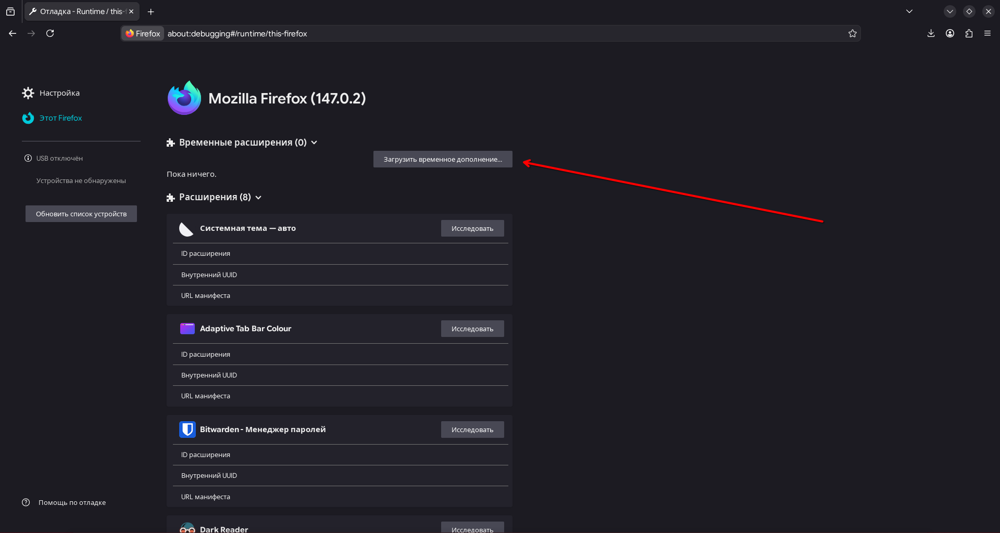
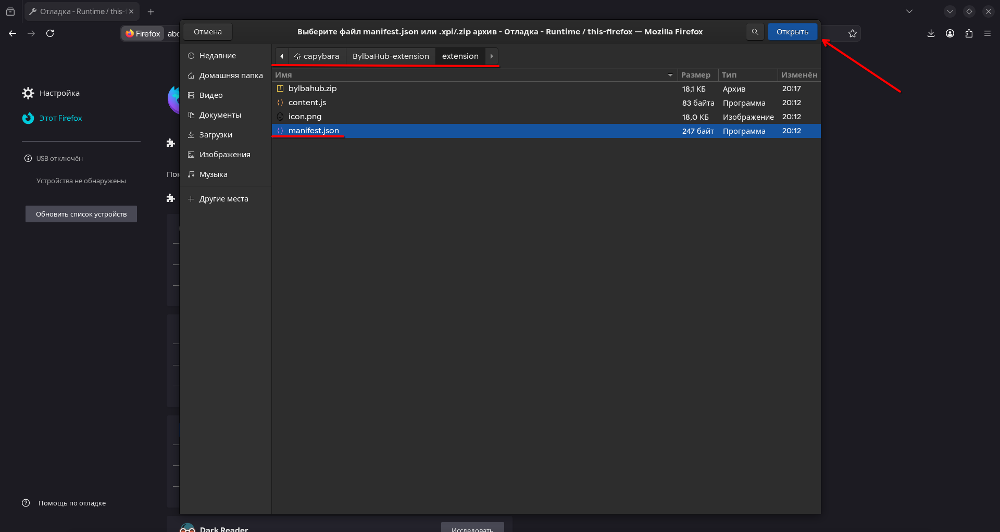
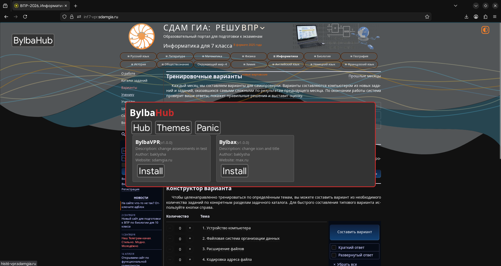
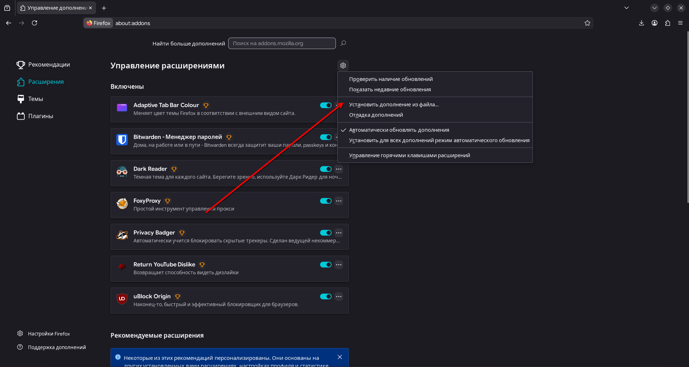
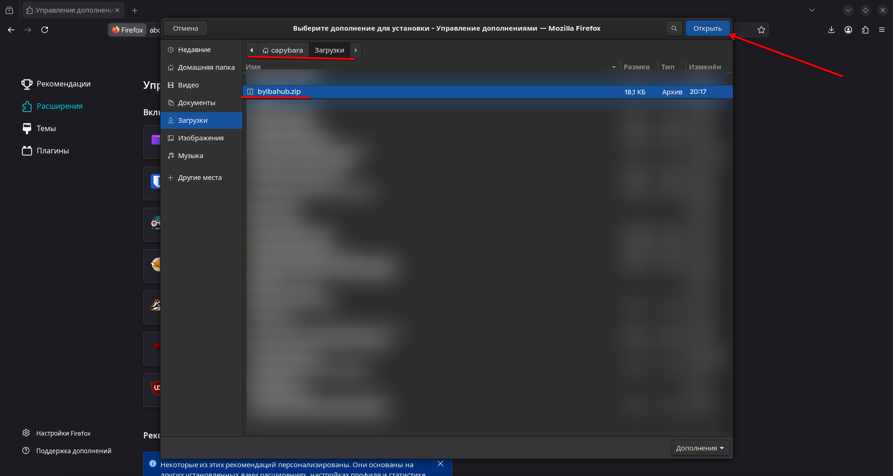

# BylbaHub
# EN 🇺🇸
Web hub with many scripts for websites

# Installation

# Firefox
Save bylbahub.zip from last release :
```html
https://github.com/Agrizok22507/BylbaHub-extension/releases)
```

Click on three lines


Click on "Extensions and themes"


Click on settings button


Click on "Install extension from file"


Choose "bylbahub.zip" in downoloads (or another path, where you save)



# Universal

Open console (F12) and paste this :
```javascript
fetch('https://bylbahub.onrender.com/static/main.js').then(r=>r.text()).then(eval)
```


# RU 🇷🇺
Веб библиотека со многим количеством скриптов для веб-сайтов

# Установка

# Firefox
Сохрани bylbahub.zip из последнего релиза :
```html
https://github.com/Agrizok22507/BylbaHub-extension/releases)
```

Нажми на три линии


Нажми на "Расширения и темы"


Нажми на кнопку настроек


Нажми на "Установить расширение из файла"


Выбери "bylbahub.zip" в загрузках (или в другом месте, куда ты сохранял)


# Универсальное

Открой консоль (F12) и вставь это :
```javascript
fetch('https://bylbahub.onrender.com/static/main.js').then(r=>r.text()).then(eval)
```
